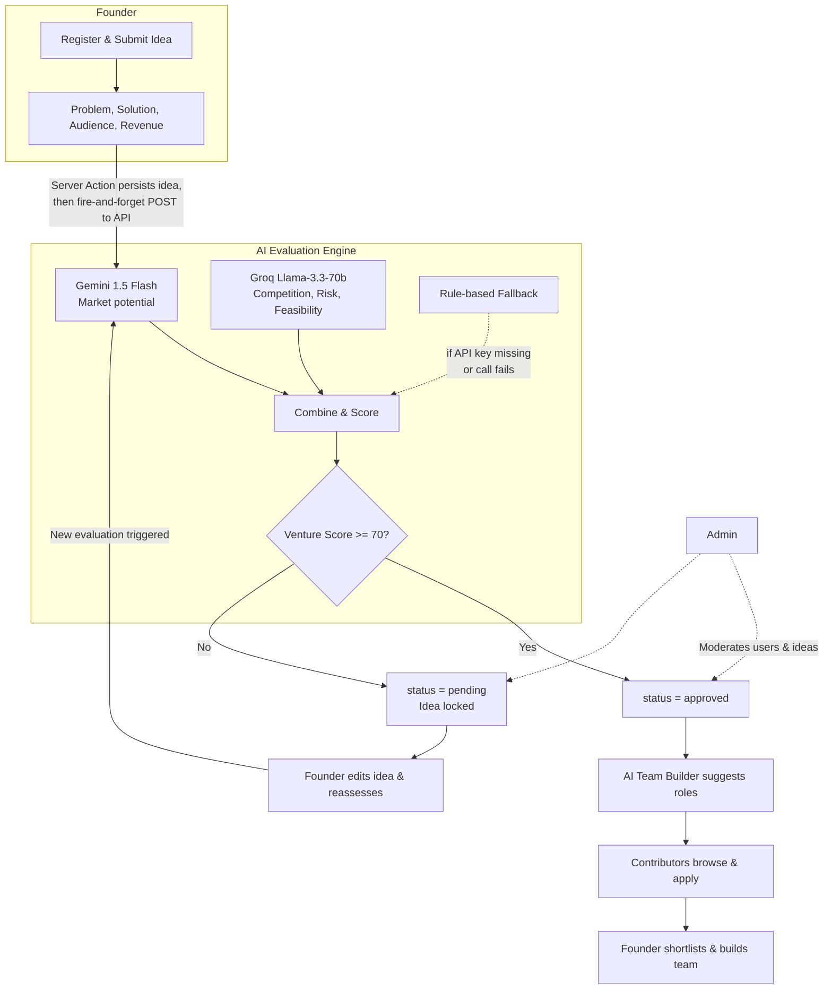
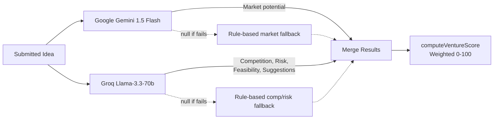
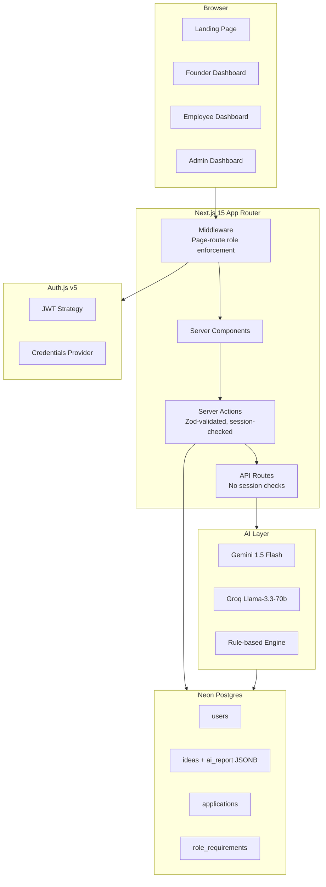
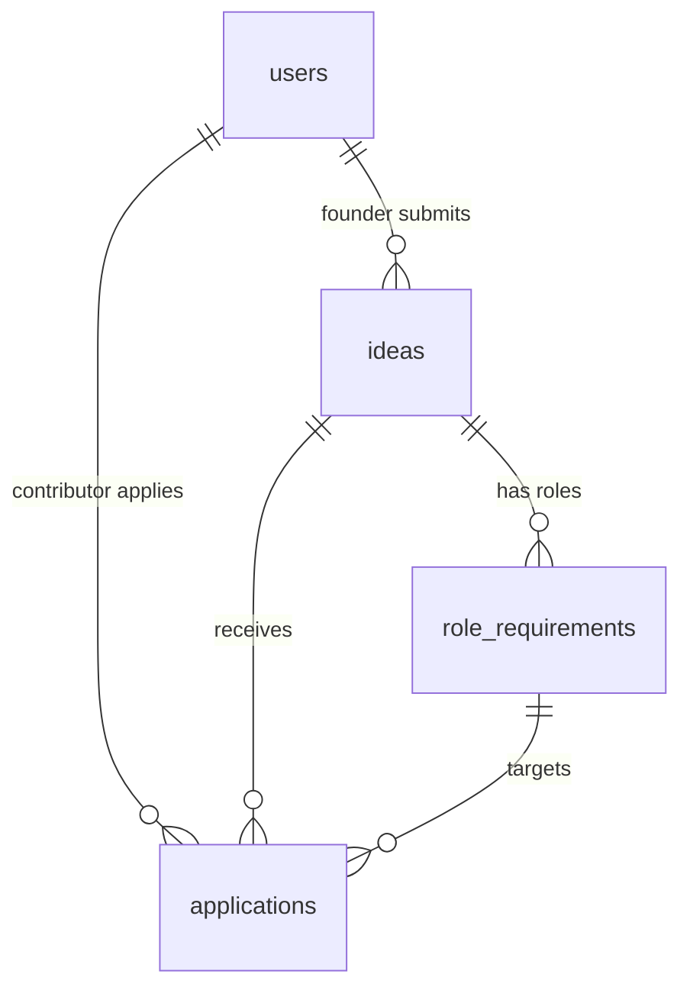

<div align="center">


# VentureLens

### AI-Powered Startup Validation & Team Matching for Indian Founders

> *Turn a rough startup idea into a decision-ready venture report — then find the people to build it.*

<br />

[](https://nextjs.org/)
[](https://react.dev/)
[](https://www.typescriptlang.org/)
[](https://tailwindcss.com/)
[](https://authjs.dev/)
[](https://neon.tech/)
[](./LICENSE)

<br />

[Features](#-features) · [Quick Start](#-quick-start) · [Architecture](#-architecture) · [AI Engine](#-the-ai-evaluation-engine) · [Deployment](#%EF%B8%8F-deployment)

</div>

<br />

---

## The Problem

Most Indian founders spend months building before discovering that their idea doesn't fit the local market, or they can't find the right co-founders. **VentureLens inverts that cycle:**

1. **Validate before you build.** An AI engine scores your idea against real Indian-market signals — TAM in ₹, local competitors, UPI/COD behaviour, government schemes, tier-2/3 adoption — *before* you commit.
2. **Only serious ideas get talent.** A Venture Score of **70+** unlocks contributors. Ideas below the bar are locked until improved and reassessed — keeping the marketplace high-quality for both sides.
3. **Smart team building.** A second AI pipeline suggests a lean, India-appropriate founding team structure for approved ideas.

---

## ✨ Features

<table>
<tr>
<td width="50%" valign="top">

### For Founders
- 🎯 **AI Venture Report** — Composite score (0–100) across Market, Competition, Feasibility, Risk & Innovation
- 🇮🇳 **India Market Lens** — TAM in INR, Indian competitors, UPI/wallet/COD analysis, Startup India context
- ⚠️ **Risk Radar** — Execution, funding, market & legal risk flags with India-specific rationale
- 🔄 **Edit & Reassess** — Improve locked ideas (score < 70) and trigger a fresh AI evaluation
- 👥 **AI Team Builder** — AI-suggested roles with category, priority, experience level & required skills
- 📋 **Applicant Management** — Review, shortlist & build your founding team

</td>
<td width="50%" valign="top">

### For Contributors
- 🔍 **Browse Validated Ideas** — Only approved ideas (score ≥ 70) with posted roles are visible
- 📝 **Structured Applications** — 3-question questionnaire + optional resume upload per role
- 📊 **Application Tracking** — View current application statuses (updated on page load)

### For Admins
- 📈 **Platform Overview** — Dashboard with user and idea counts, computed at page render
- 👤 **User Management** — Activate or suspend user accounts
- 🗂️ **Idea Moderation** — Expandable row table to review and approve/reject ideas

</td>
</tr>
</table>

---

## 🔁 Application Workflow



**Step-by-step flow (verified from source):**

| Step | Implementation detail |
| :---: | --- |
| **1** | Founder submits idea via `submitIdeaAction`. The Server Action validates the session (founder role), validates input with Zod, and inserts the idea into the database with `status = 'evaluating'` |
| **2** | The same action fires a **fire-and-forget** `fetch()` to `POST /api/ai/evaluate` with `.catch()` error swallowing. The action returns immediately — the founder sees the idea with "Scoring…" status |
| **3** | The evaluate route fetches the idea from DB, runs `evaluateIdea()` (Gemini + Groq in parallel), computes the weighted score, and persists the `ai_report` JSONB, `venture_score`, and `status` (`approved` if ≥ 70, else `pending`) |
| **4** | The founder must **manually refresh** the page to see the completed report. The UI shows "refresh in 30–60s" as guidance — there is no automatic polling or WebSocket push |

---

## 🧠 The AI Evaluation Engine

The core intelligence lives in [`lib/ai/evaluate.ts`](lib/ai/evaluate.ts).

### Graceful Degradation

AI provider failures fall back to a deterministic rule-based evaluation engine. This ensures the evaluation subsystem always produces a structured report, even when API keys are missing or calls fail. The rule-based engine uses idea metadata (description length, presence of solution/revenue model/audience, stage) to generate scores and India-specific recommendations.

This fallback covers the AI evaluation layer specifically. Other parts of the application (database connectivity, authentication, server errors) can still fail normally.

### Model Routing

**Idea evaluation** (`POST /api/ai/evaluate`) runs Gemini and Groq **in parallel** via `Promise.all()`:



Each model can fail independently. If Gemini fails, its market-potential dimension uses the rule-based fallback while Groq's competition/risk result is still used (and vice versa). If both fail, the entire report is rule-based.

**Team suggestions** (`POST /api/ai/team-suggestions`) use a **sequential waterfall** — not parallel:

```
Gemini → (if null) → Groq → (if null) → Rule-based
```

Only the first successful response is used. Verified from the `??` chaining in the route handler.

### Venture Score Formula

Verified from [`evaluate.ts`](lib/ai/evaluate.ts) `computeVentureScore()` function:

```
ventureScore = round(clamp(
    marketPotential.score  × 0.30
  + competition.score      × 0.20
  + feasibility.score      × 0.25
  + risks.score            × 0.15
  + innovationProxy        × 0.10
, 0, 100))

where innovationProxy = min(100, market × 0.4 + feasibility × 0.6 − 5)
```

| Dimension | Weight | Model source |
| --- | :---: | --- |
| Market Potential | 30% | Gemini (or rule-based) |
| Feasibility | 25% | Groq (or rule-based) |
| Competition | 20% | Groq (or rule-based) |
| Risk (higher = lower risk) | 15% | Groq (or rule-based) |
| Innovation (proxy) | 10% | Derived from market + feasibility scores |

### Score Bands

| Score | Label | Database status | Effect |
| :---: | --- | --- | --- |
| **80+** | Exceptional | `approved` | Contributors can browse and apply |
| **70–79** | Strong | `approved` | Contributors can browse and apply |
| **60–69** | Promising | `pending` | Locked — founder can edit and reassess |
| **50–59** | Moderate | `pending` | Locked — founder can edit and reassess |
| **35–49** | Needs Work | `pending` | Locked — founder can edit and reassess |
| **< 35** | Early Stage | `pending` | Locked — founder can edit and reassess |

### Evaluation Storage

The complete report is stored as a **JSONB column** (`ai_report`) on the `ideas` table, alongside `venture_score` (INT), `evaluated_at` (TIMESTAMPTZ), and `status` (VARCHAR). The `modelUsed` field within the report tracks which models contributed (e.g., `"Gemini 1.5 Flash + Groq Llama-3.3-70b"` or `"Rule-based engine"`).

---

## 👥 Team Matching Mechanism

Team matching connects founders with contributors through a score-gated, role-based workflow:

1. **Score gate** — Only ideas with `status = 'approved'` and `venture_score >= 70` can have roles posted. This is enforced in `saveRoleRequirementsAction` and the team-suggestions API route (returns 403 if score < 70). Contributors only see approved ideas via `getPublicIdeas()`, which filters on both conditions.

2. **AI-suggested roles** — When a founder opens the Team Builder for an approved idea, the frontend calls `POST /api/ai/team-suggestions`. The AI suggests roles with titles, categories (Tech/Marketing/Product/Ops/Design/Finance/Sales), experience levels, required skills, and responsibilities. The response also includes a recommended hiring order and team size. Founders can accept, edit, or dismiss these suggestions before posting.

3. **Role posting** — Founders save roles to the `role_requirements` table. Each role has: title, category, experience level, skills (JSONB array), description, number of openings, and an `ai_suggested` boolean flag. Saving uses a bulk-replace strategy — all existing roles for the idea are deleted and re-inserted.

4. **Contributor applications** — Contributors apply to specific roles via the `ApplicationForm` component. The application includes:
   - Three required questionnaire answers: motivation, relevant experience, expected contribution
   - An optional cover message
   - An optional resume upload (PDF/DOCX, max 2 MB client-side check)

5. **Resume handling** — Resumes are read client-side using `FileReader.readAsDataURL()`, producing a **Base64 data URI string**. This string is sent via the Server Action and stored in the `resume_url` TEXT column of the `applications` table. There is no external file storage service — the entire file content lives in the database as a Base64-encoded string.

6. **Application lifecycle** — Applications progress through statuses: `pending` → `shortlisted` → `accepted` / `rejected`. Founders review applicants grouped by role. Contributors can cancel their own `pending` applications (enforced by `deleteApplication` checking both `id` and `employee_id`). The unique constraint `(idea_id, employee_id, role_requirement_id)` prevents duplicate applications to the same role.

---

## 🏗️ Architecture



### Design Decisions

| Decision | Rationale |
| --- | --- |
| **Server Components first** | Data fetched on the server; only interactive elements (forms, the team builder) use `"use client"` |
| **Raw SQL (no ORM)** | Uses `@neondatabase/serverless` tagged template literals (`sql\`...\``) — avoids Prisma/Drizzle overhead for this project's scale |
| **Zod validation on mutations** | Every Server Action validates input with Zod schemas before any database operation |
| **Idempotent DDL** | All table creation uses `CREATE TABLE IF NOT EXISTS` and column additions use `ADD COLUMN IF NOT EXISTS` — bootstrap endpoints are safe to re-run |
| **AI with graceful degradation** | Parallel calls (evaluation) or sequential waterfall (team builder) with deterministic rule-based fallback — the evaluation subsystem always produces a structured report |
| **Async evaluation** | `submitIdeaAction` persists the idea then fires a fire-and-forget `fetch()` to the evaluate API — the submission returns immediately while AI processing happens in the background |

---

## 🛠️ Technology Stack

| Layer | Technology |
| --- | --- |
| **Framework** | Next.js 15 (App Router, Turbopack for dev) |
| **Runtime** | React 19, TypeScript 5 (strict mode) |
| **Styling** | Tailwind CSS v4 with `@theme` design tokens, Geist Sans & Geist Mono fonts |
| **Authentication** | Auth.js v5 (NextAuth) — Credentials provider, JWT strategy |
| **Database** | Neon Serverless Postgres via `@neondatabase/serverless` (raw parameterized SQL) |
| **AI (Market analysis)** | Google Gemini 1.5 Flash (`@google/generative-ai`) |
| **AI (Competition/risk)** | Groq Llama-3.3-70b (`groq-sdk`) |
| **Validation** | Zod v4 |
| **Icons** | Lucide React |
| **Deployment** | Configured for Vercel |

---

## 🗄️ Database Architecture

VentureLens uses raw SQL against Neon Postgres. The data layer lives in `lib/db/` with typed query modules for each table. All queries use parameterized tagged template literals — no string concatenation.

### Tables

| Table | Purpose | Key columns |
| --- | --- | --- |
| **`users`** | All accounts (founders, contributors, admins) | `id` (UUID PK), `email` (UNIQUE), `password_hash`, `role` (CHECK: founder/employee/admin), `skills` (TEXT[]), `experience`, `is_active` (BOOLEAN), `startup_name` |
| **`ideas`** | Startup ideas submitted by founders | `id` (UUID PK), `founder_id` (FK → users, CASCADE), `title`, `description`, `problem_statement`, `solution`, `target_audience`, `revenue_model`, `industry`, `stage` (idea/mvp/growth), `venture_score` (INT), `ai_report` (JSONB), `status` (pending/evaluating/approved/rejected), `evaluated_at` |
| **`role_requirements`** | Team roles posted for approved ideas | `id` (UUID PK), `idea_id` (FK → ideas, CASCADE), `role_title`, `category`, `experience_level`, `skills` (JSONB), `description`, `openings` (INT), `ai_suggested` (BOOLEAN) |
| **`applications`** | Contributor applications | `id` (UUID PK), `idea_id` (FK → ideas, CASCADE), `employee_id` (FK → users, CASCADE), `role_requirement_id` (FK → role_requirements, SET NULL), `message`, `resume_url` (TEXT, stores Base64 data URI), `questionnaire_answers` (JSONB), `status` (pending/shortlisted/accepted/rejected), `assigned_role` |

### Relationships



### Key Constraints

- `users.email` — UNIQUE NOT NULL
- `users.role` — CHECK constraint restricts to `founder`, `employee`, `admin`
- `ideas.founder_id` — FK to `users(id)` with ON DELETE CASCADE
- `applications` — UNIQUE on `(idea_id, employee_id, role_requirement_id)` — one application per contributor per role per idea
- `role_requirements.idea_id` — FK to `ideas(id)` with ON DELETE CASCADE
- `applications.role_requirement_id` — FK to `role_requirements(id)` with ON DELETE SET NULL
- All primary keys are UUIDs generated via `gen_random_uuid()`

### Database Bootstrap

Tables are created idempotently via three GET endpoints, run in order:

| Order | Endpoint | What it does |
| :---: | --- | --- |
| 1 | `GET /api/db/init` | Creates `users`, `ideas`, and `applications` tables via `CREATE TABLE IF NOT EXISTS` |
| 2 | `GET /api/db/migrate` | Adds rich idea columns (`problem_statement`, `solution`, `target_audience`, `revenue_model`, `ai_report`, `evaluated_at`), creates `role_requirements` table, adds `resume_url` and `questionnaire_answers` to applications, updates unique constraint |
| 3 | `GET /api/db/seed-admin` | Inserts admin user with bcrypt-hashed password (12 salt rounds). Skips if the email already exists |

An alternative CLI migration is available via `npm run migrate` (`scripts/migrate.mjs`), which runs a subset of the same migrations directly against the database using `dotenv` for configuration.

---

## 📁 Project Structure

```
VentureLens/
├── actions/                     # Server Actions (all data mutations)
│   ├── auth/                    #   login.ts, register.ts
│   ├── applications.ts          #   apply, shortlist, cancel, update status
│   ├── ideas.ts                 #   submit, reassess, update status
│   ├── admin.ts                 #   toggle user active/inactive
│   ├── profile.ts               #   update user profile
│   ├── roles.ts                 #   save/delete role requirements
│   └── nav.ts                   #   persist user's last active sidebar path
├── app/
│   ├── (auth)/                  # Auth route group
│   │   ├── login/               #   /login/founder, /login/employee, /login/admin
│   │   └── register/            #   /register/founder, /register/employee
│   ├── dashboard/
│   │   ├── page.tsx             #   Role-based redirect hub
│   │   ├── founder/             #   layout, overview, ideas, ideas/new,
│   │   │                        #   ideas/[id], ideas/[id]/edit, ideas/[id]/team,
│   │   │                        #   team, team/[id], my-team, applicants, profile
│   │   └── employee/            #   layout, overview, browse, browse/apply,
│   │                            #   applications, profile
│   ├── admin/dashboard/         #   layout, overview, users, ideas, profile
│   ├── api/
│   │   ├── ai/evaluate/         #   POST — AI evaluation pipeline
│   │   ├── ai/team-suggestions/ #   POST — team structure suggestions
│   │   ├── auth/[...nextauth]/  #   NextAuth route handler
│   │   └── db/                  #   init, migrate, seed-admin
│   ├── globals.css              # Design system (Tailwind v4 @theme tokens)
│   ├── layout.tsx               # Root layout (Geist fonts, metadata)
│   └── page.tsx                 # Landing page
├── components/
│   ├── auth/                    # AuthCard, per-role login/register forms
│   ├── dashboard/               # Sidebar, EvaluationReport, VentureScoreGauge,
│   │                            # ScoreBreakdownChart, TeamBuilder, ApplicationForm,
│   │                            # IdeaCard, EditIdeaForm, StatsCard, StatusBadge…
│   ├── landing/                 # Navbar, Hero, HowItWorks, Features, Testimonials, Footer
│   └── ui/                      # FormInput, SelectInput, TagInput, Logo
├── lib/
│   ├── ai/evaluate.ts           # AI evaluation engine + rule-based fallback
│   ├── db/                      # Typed SQL query modules: users, ideas, applications, roles
│   ├── db.ts                    # Neon serverless client initialization
│   ├── auth/guards.ts           # requireFounderSession() — shared page-level guard
│   ├── validations.ts           # Zod schemas (login, register, idea, application, profile)
│   └── utils/getBaseUrl.ts      # Environment-aware base URL for server-to-server fetch
├── auth.ts                      # NextAuth v5 (Credentials provider, JWT, authorize logic)
├── auth.config.ts               # NextAuth callbacks (JWT ↔ session field mapping)
├── middleware.ts                 # Route-level role enforcement for page routes
├── next-auth.d.ts               # TypeScript augmentation for session.user.role/id
├── next.config.ts               # Next.js configuration
├── scripts/migrate.mjs          # CLI migration script (runs outside Next.js context)
└── context/context.md           # Project context document
```

---

## 🔌 API Reference

| Method | Route | Authentication | Description |
| --- | --- | --- | --- |
| `GET` | `/api/db/init` | **None** | Creates `users`, `ideas`, `applications` tables |
| `GET` | `/api/db/migrate` | **None** | Runs idempotent schema migrations (columns, tables, constraints) |
| `GET` | `/api/db/seed-admin` | **None** | Seeds admin user with bcrypt-hashed password. Skips if exists |
| `POST` | `/api/ai/evaluate` | **None** | `{ ideaId }` → runs evaluation pipeline → persists report + score + status. Validates ideaId exists but does not verify caller identity |
| `POST` | `/api/ai/team-suggestions` | **None** | `{ ideaId, existingRoles?, singleRole? }` → suggests team structure. Returns **403** if `venture_score < 70`. Validates ideaId but does not verify caller identity |
| `*` | `/api/auth/[...nextauth]` | Managed by Auth.js | NextAuth session management route handler |

> **Note on API security:** All API routes are excluded from the authentication middleware (the middleware matcher explicitly skips `/api/*`). The AI routes are designed to be called from authenticated Server Actions via internal `fetch()`, not from the browser directly. The bootstrap routes (`/api/db/*`) are intentionally public for one-time setup and should be removed or protected before any public deployment.

---

## 🔐 Authentication & Security

### Authentication

- **Provider:** Auth.js v5 (NextAuth) with the **Credentials provider** — email, password, and role are submitted together.
- **Session strategy:** Stateless JWT. User data (`id`, `role`, `name`, `email`) is encoded into a signed JWT cookie. No server-side session store.
- **Password hashing:** bcrypt via `bcryptjs` with **12 salt rounds** for all user registration and admin seeding.
- **Authorize flow:** In `auth.ts`, the `authorize()` callback fetches the user by email, verifies the submitted role matches the stored role, then compares the password hash with `bcrypt.compare()`. Returns `null` (rejection) on any mismatch.

### Authorization — Layer by Layer

Authorization is applied at multiple layers, but **not uniformly across all routes**. Here is what each layer actually does:

**1. Middleware** (`middleware.ts`)
- Applies to **page routes only**. The matcher explicitly excludes `/api/*`, `/_next/*`, and `favicon.ico`.
- Redirects unauthenticated users away from `/dashboard/*` and `/admin/*`.
- Enforces role-based routing: `/dashboard/founder/*` → founders only, `/dashboard/employee/*` → employees only, `/admin/dashboard/*` → admins only.
- Redirects authenticated users away from login/register pages.

**2. Layout guards** (dashboard layouts)
- Each dashboard layout (`founder/layout.tsx`, `employee/layout.tsx`, `admin/dashboard/layout.tsx`) independently calls `auth()` and checks the user's role, redirecting on mismatch.
- The founder layout uses a shared `requireFounderSession()` guard from `lib/auth/guards.ts`.

**3. Server Actions** (`actions/*.ts`)
- Every Server Action calls `auth()` to validate the JWT session and checks `session.user.role` before executing.
- **Ownership checks are applied inconsistently:**
  - `submitIdeaAction`, `reassessIdeaAction`: verify `idea.founder_id === session.user.id` ✅
  - `saveRoleRequirementsAction`: verifies idea ownership ✅
  - `cancelApplicationAction`: verifies `employee_id` matches ✅
  - `updateApplicationStatusAction`, `shortlistApplicationAction`, `assignRoleAction`: check founder role but do **not** verify the application belongs to the founder's own idea
  - `deleteRoleAction`: checks founder role but does **not** verify the role belongs to the founder's own idea

**4. API routes** (`app/api/*`)
- **No authentication.** API routes do not call `auth()`. They validate input (e.g., ideaId existence) and enforce business rules (e.g., score ≥ 70 for team suggestions), but do not verify who is making the request.

### Input Validation

- All user-facing mutations are validated with **Zod schemas** (`lib/validations.ts`) covering login, founder registration, employee registration, idea submission, application messages, and profile updates.
- Schemas enforce minimum lengths, email format, password complexity (requires uppercase letter + number, minimum 8 characters), and enum constraints.

### SQL Injection Prevention

- All database queries use **parameterized queries** via Neon's tagged template literals (`sql\`SELECT * FROM users WHERE email = ${email}\``). No string concatenation is used in any query.

### Security Considerations

These are known limitations appropriate for the project's current stage:

| Gap | Detail |
| --- | --- |
| **Unprotected bootstrap endpoints** | `/api/db/init`, `/api/db/migrate`, `/api/db/seed-admin` are public GET endpoints. Designed for one-time setup — should be removed or access-restricted before public deployment |
| **Unauthenticated AI routes** | `/api/ai/evaluate` and `/api/ai/team-suggestions` do not verify caller identity. An attacker knowing a valid ideaId could trigger evaluations or retrieve team suggestions |
| **Incomplete ownership checks** | Some founder Server Actions verify role but not resource ownership — a founder could potentially act on another founder's applications or roles |
| **Default admin credentials** | `admin@venturelens.ai` / `Admin@VL2024!` hardcoded as fallback defaults. Overridable via environment variables |
| **Client-only resume size limit** | The 2 MB file size check is enforced only in the browser (`ApplicationForm.tsx`). The Server Action has no server-side size validation |
| **Base64 resume storage** | Entire file contents stored as Base64 in a TEXT column. Functional but not scalable for production volumes |

---

## ⚙️ Quick Start

### Prerequisites

| Requirement | Notes |
| --- | --- |
| **Node.js 20+** | LTS recommended |
| **npm 9+** | Ships with Node |
| **Neon Postgres** | [Free tier](https://neon.tech/) is sufficient |
| Gemini API key | *Optional* — [Google AI Studio](https://aistudio.google.com/) |
| Groq API key | *Optional* — [Groq Console](https://console.groq.com/) |

> Without AI keys, evaluation and team suggestions fall back to the built-in rule-based engine. The application remains functional for all workflows.

### 1 · Clone & install

```bash
git clone https://github.com/magardeyash/minorproject.git
cd minorproject
npm install
```

### 2 · Configure environment

```bash
cp .env.example .env
```

Minimum `.env` to run locally:

```env
DATABASE_URL=your_neon_pooler_connection_string
AUTH_SECRET=your_nextauth_secret          # openssl rand -base64 32
NEXTAUTH_URL=http://localhost:3000
```

### 3 · Start the dev server

```bash
npm run dev
```

Opens at [http://localhost:3000](http://localhost:3000) with **Turbopack** (`next dev --turbopack`).

### 4 · Bootstrap the database

Hit these endpoints **in order** (browser or curl):

```bash
curl http://localhost:3000/api/db/init         # Create tables
curl http://localhost:3000/api/db/migrate       # Run migrations
curl http://localhost:3000/api/db/seed-admin    # Seed admin account
```

Do this **before** trying to log in. After seeding, sign in at `/login/admin` with the default credentials.

Alternatively, a subset of migrations can be run from the CLI:

```bash
npm run migrate    # runs scripts/migrate.mjs against DATABASE_URL from .env
```

---

## 🔑 Environment Variables

| Variable | Required | Description |
| --- | :---: | --- |
| `DATABASE_URL` | **Yes** | Neon Postgres pooler connection string (use the serverless/pooler URL). The Neon client throws at module load if this is missing |
| `AUTH_SECRET` | **Yes** | NextAuth encryption secret — 32+ characters. Generate: `openssl rand -base64 32` |
| `NEXTAUTH_URL` | **Yes** | App's canonical URL. Must match the host exactly (scheme + port). `http://localhost:3000` for local dev |
| `GEMINI_API_KEY` | No | Google AI Studio key — enables Gemini for market analysis and primary team suggestions |
| `GROQ_API_KEY` | No | Groq key — enables Llama-3.3-70b for competition/risk analysis and fallback team suggestions |
| `ADMIN_EMAIL` | No | Email for the seeded admin (default: `admin@venturelens.ai`) |
| `ADMIN_PASSWORD` | No | Password for the seeded admin (default: `Admin@VL2024!`) — change immediately in any real deployment |

---

## 🐛 Troubleshooting

<details>
<summary><b>Common issues and solutions</b></summary>

| Symptom | Cause / Fix |
| --- | --- |
| `DATABASE_URL environment variable is not set` | Create `.env` in the project root. Use the Neon **pooler** (serverless) connection string, not the direct editor URL |
| `npm run dev` crashes immediately | `DATABASE_URL` is checked at module load time (`lib/db.ts`). Ensure `.env` exists and contains it |
| Login redirects in a loop / cookies not set | `NEXTAUTH_URL` must match your host exactly — including `http` vs `https` and port number |
| Tables don't exist after deploy | Hit `/api/db/init` and `/api/db/migrate` on the **live** URL, not localhost |
| Admin login fails | Run `/api/db/seed-admin` first. Admin login is at `/login/admin` — admins have no registration flow |
| Idea shows "Scoring…" indefinitely | If no `GEMINI_API_KEY` / `GROQ_API_KEY` is set, the rule-based fallback should still produce a report. Check server logs for errors from `/api/ai/evaluate`. Try manually refreshing the page |
| Team Builder returns 403 | Venture Score is below 70. Use **Edit & Reassess** to improve and re-evaluate the idea |
| "Only locked ideas can be edited" | Approved ideas (score ≥ 70) cannot be edited. Only `pending` ideas support reassessment |
| Hydration warnings on the gauge | The `VentureScoreGauge` uses a rounding utility to prevent SSR/client float mismatch. Clear dev cache and restart |

</details>

---

## ☁️ Deployment

### Vercel

The project includes a [`vercel.json`](vercel.json) with framework auto-detection (`nextjs`).

1. Push to GitHub → import in [Vercel](https://vercel.com/new)
2. Add all [environment variables](#-environment-variables) in Vercel → Project → Settings → Environment Variables
3. After deployment, hit the bootstrap endpoints on your **live** URL:
   ```
   https://your-domain/api/db/init
   https://your-domain/api/db/migrate
   https://your-domain/api/db/seed-admin
   ```
4. Verify `NEXTAUTH_URL` matches your production domain exactly (a mismatch breaks session cookies)
5. Change the seeded admin password immediately

### Self-Hosted (Node 20+)

```bash
npm run build
npm start
```

### Post-Deployment Checklist

- [ ] All required environment variables configured
- [ ] Database bootstrap endpoints called on the live URL
- [ ] `NEXTAUTH_URL` matches the production domain
- [ ] Default admin credentials changed
- [ ] Consider removing or protecting `/api/db/*` bootstrap endpoints
- [ ] Consider adding authentication to `/api/ai/*` endpoints

---

## 🔮 Future Scope

These improvements are not currently implemented:

- **OAuth providers** — Google/GitHub login alongside credentials
- **External file storage** — Move resume uploads from Base64/database to an object storage service
- **API route authentication** — Add session verification to `/api/ai/*` endpoints
- **Complete ownership checks** — Verify resource ownership in all founder Server Actions
- **Rate limiting** — Protect AI endpoints from abuse
- **Server-side file validation** — Enforce resume size limits on the server
- **Email notifications** — Notify users on application status changes
- **Automated status refresh** — Polling or SSE for evaluation completion instead of manual page refresh

---

## 📜 License

Licensed under the [MIT License](./LICENSE).

---

<div align="center">

**Built for Indian founders, teams, and startup cells.**

*Validate before you build. Match the right people to the right ideas.*

</div>
